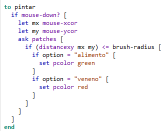

# Tarea 1
Nicolas Parra Garcia
## Pregunta 1 
Se cambia la forma a una persona.

## Pregunta 2
.gif>)\
Se realiza por medio de la función pintar, que verifica si el mouse esta siendo presionado, luego en la posición del mouse le pide a los parches que estén dentro del radio de pintado que cambien de color dependiendo de la selección en la opción. \

## Pregunta 3
Implementacion de error genetico, se da por las variables globales error-gen (que es el computo de mutacion), angulo-random (que es el computo de variacion al mutar) y error-genetico (que es la probabilidad de mutar).

## Pregunta 4

## Pregunta 5
A continuación se prestan imágenes del experimento repetido para diversos % de mutación.
### 0%

### 5%

### 15%

### 30%
\
Podemos notar que a medida que la probabilidad aumenta, la dispersión de los agentes también, es decir que con el incremento de la mutación genética para cambiar de ángulo, se forman clusters menos claros y se convierte en una nube de agentes. En el gráfico se presenta como variaciones de población con cambios más bruscos (o escalados) debido a los crecimientos espontáneos por la variación en dirección.