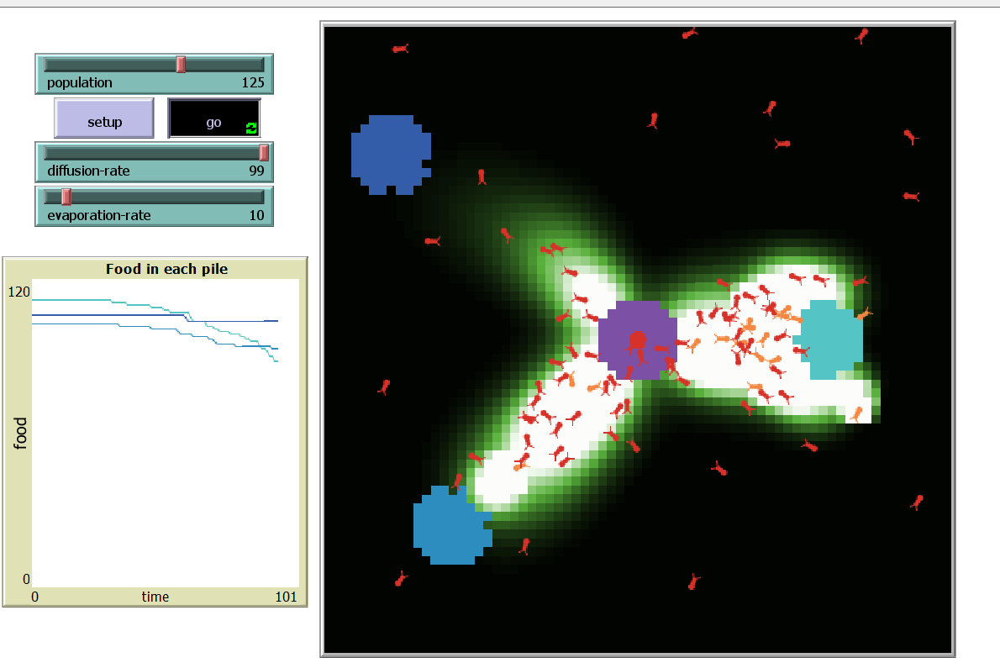
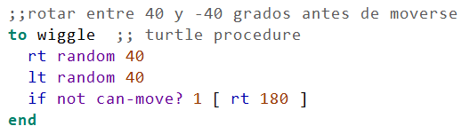

# Tarea 2
Nicolas Parra Garcia\
2029422588
## Pregunta 1
### Comportamiento normal 

### 0 evaporation rate

Cuando no hay evaporacion los quimicos se mantienen en el mundo, haciendo que se acumule hasta que todos los patches tengan maximo valor, las hormigas no pueden diferenciar en donde esta la comida.
### 0 diffusion rate
Al no haber difucion los quimicos no se exparsen, creando lineas dificiles de seguir.

### max evaporation-rate
Es como si no hubiera quimico debido a que desaparece muy rapido.

### max difussion rate
El quimico es detectable de muy lejos por lo que confunde a las hormigas.

## Pregunta 2
- **SetupFood:** 
- **to-go:**
-**Uphill-chemical:**
-**Wiggle:** 
## Pregunta 3
Al recoger comida se hace la llamada a  uphill-nest-scent el cual verifica constantemente si la tortuga se encuentra en el nest, de lo contrario sigue el nest-chemical con un angulo de busqueda entre -45 y 45 grados y se mueve hasta llegar a este. 
## Pregunta 4
Comida equidistante\
Se puede observar que las hormigas obtienen comida de los 3 food source simultaneamente 

## Pregunta 5
Implementacion *naive* donde las hormigas recuerdan donde esta su hogar

## Pregunta 6
\
Al no haber limite superior las hormigas se atascan, moviendose hacia donde hay mas concentracion de quimico, es decir en el camino y no en la comida. Esto hace que se corte el rastro de quimico.
