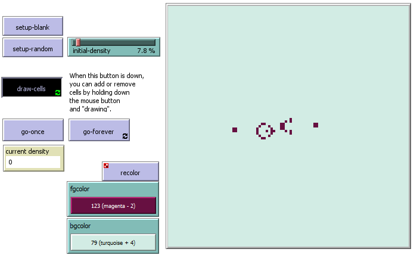

# Tarea: Respondiendo preguntas 
## Pregunta 1
### Modelo Preliminar
El modelo se enfocará en la simulación de toma de decisiones utilizando un sistema multiagente, donde cada agente es un modelo de lenguaje grande (LLM) que opera bajo políticas específicas. Estos agentes funcionan como jueces que analizan un input común y, basándose en sus políticas, emiten una decisión. Las decisiones individuales se integran en un resultado final, emergiendo una solución colectiva que se comporta como un fenómeno de emergencia. Este enfoque destaca cómo las interacciones entre múltiples agentes  pueden generar comportamientos complejos y adaptativos en el sistema, que son difíciles de predecir a partir de las propiedades de los agentes individuales.

**Interrelaciones y Fenómenos Emergentes:**

    Agentes: Cada agente tiene una política específica que guía su decisión.
    Políticas: Dictan el comportamiento del agente en respuesta al input.
    Decisiones: Cada agente toma una decisión basada en su política, que se combina con las decisiones de otros agentes.
    Solución emergente: El resultado colectivo es un fenómeno emergente, donde la interacción de múltiples decisiones individuales produce una solución que no se podría anticipar solo observando las políticas individuales.
(a modo de analisis macroscopico forma el resultado colectivo y la solucion emergente y de microscopico, proviene del comportamiento de cada agente y sus intereacciones)

### Herramienta mas apta
Mason, debido a que puede manejar simulaciones complejas a gran escala en combinacion a herramientas en python para manejar los agentes.
## Pregunta 2
### Gran escala
Elegiría Repast HPC o FLAME GPU, ambas herramientas están diseñadas para simulaciones a gran escala, permitiendo la gestión eficiente de cientos de miles de agentes mediante el uso de capacidades de computación paralela.
### Agentes simples
NetLogo sería la herramienta ideal si el comportamiento de los agentes es simple. NetLogo es conocido por su facilidad de uso y su capacidad para simular modelos con agentes sencillos, lo que permite una rápida implementación y análisis sin necesidad de conocimientos avanzados de programación.
### Agentes complejos
Para agentes con comportamientos complejos, que incluyan aprendizaje y razonamiento, MASON o AnyLogic serían las herramientas adecuadsa. Estas plataformas soportan la implementación de agentes con capacidades avanzadas y ofrecen extensibilidad para integrar algoritmos de inteligencia artificial que permiten a los agentes aprender y razonar durante la simulación.
## Pregunta 3
La aleatoriedad se da en la función wiggle debido a que el ángulo de rotación varía de forma aleatoria al moverse.
## Pregunta 4
La aleatoriedad proviene de los mismos modelos con su temperatura al hacer inferencias (depende del modelo) o puede estar determinado por las politicas de cada agente.
## Pregunta 5
En base al juego de la vida base de la biblioteca de netlogo y luego de correrlo un par de veces se puede observar un par de patrones recurrentes.\
\
En esta primera imagen se puede observar patrones de movimiento perpetuo (pseudo pajaritos), donde estos patrones se mueven espacialmente por medio de diferentes estados recurrentes.\
\
En la segunda imagen se puede observar 2 patrones distintos, aquellos que alteran entre 2 estados distintos de forma perpetua (lineas) y aquellos que no varían (puntos).
## Pregunta 6
Se experimento con densidades bajas y altas (< 2% y > 90%) y las poblaciones mueren de inmediato.\
Un patron perpetuo es este vortice que se ve divertido.\

## Pregunta 7
Es una configuración específica del juego que genera una serie de patrones con movimiento perpetuo. Muestra la capacidad del sistema para generar patrones infinitos y autosuficientes.

