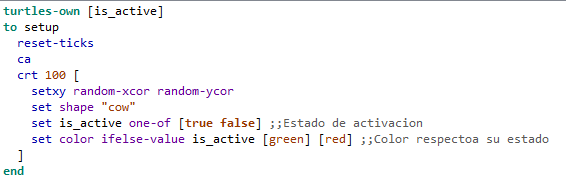
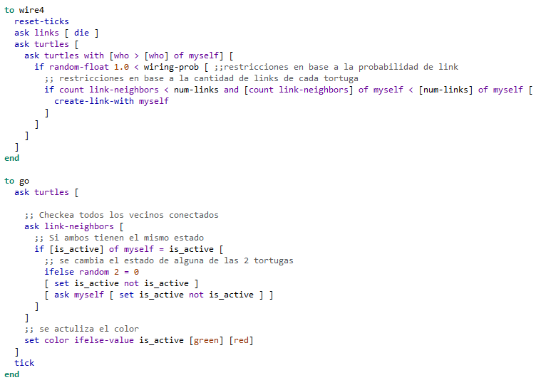
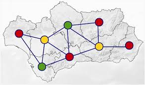

# Tarea Grafos Aleatoreos 
Nicolas Parra
# Modificaciones
Estados\
\
Conexiones\

# Preguntas
## Se quilibra el grafo? Bajo que condiciones?
https://github.com/user-attachments/assets/57b830eb-b4c6-48d6-b205-20d5c44c2c22 \
Se realizan 2 pruebas con wire4
- La priemra queda inestable por siempre
- La segunda se estabiliza de inmediato
Entonces depende de la cantidad de conexiones que tenga cada nodo
## Si no se equilibra, con que cardinal del conjunto de estados se podría lograr esto?
Para un grafo completamente conexo se requieren al menos n colores para que todos los nodos esten con distintos estados, con n la cantidad de nodos del grafo.
En caso contrario se requieren una cantidad igual a el grado del nodo con máximas conexiones + 1
## Qué problema tradicional sobre grafos se está modelando 
Coloreo de grafos (o de mapas).\

