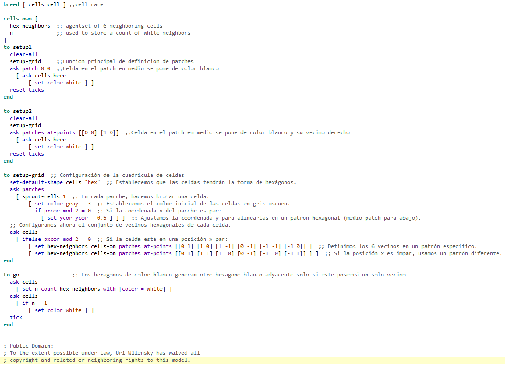
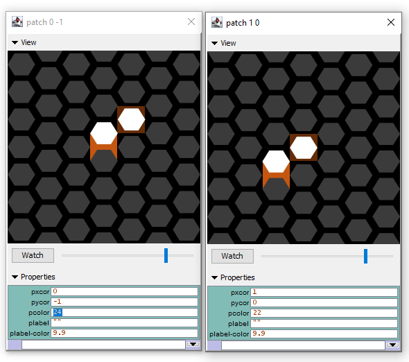

# Tarea Hex Lattice
Nicolas Parra Garcia
## Documentación

Como se observa en la siguiente imagen, el hex 0,0 que está en naranjo se encuentra desfasado del cell y su patch directamente a la derecha está coloreado en café.\
