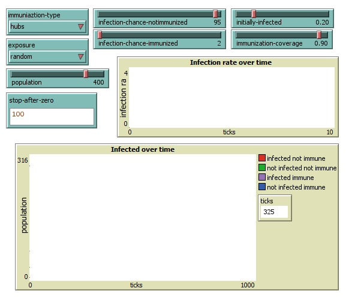
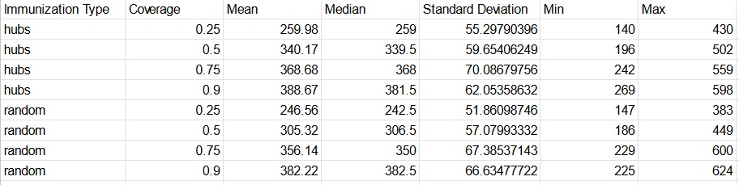
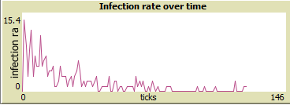

# Reporte Infección Viral

### Parámetros de las pruebas

Los parámetros escogidos tienen como objetivo mostrar cambios mas drásticos respecto a la propagación de la infección.

Parametros de ejecución.

### Datos obtenidos

Para responder las preguntas se usaron los datos obtenidos con la herramienta “Analizador de Comportamiento” de Netlogo. Esto, permite tener los datos para cada uno de los casos de observación en base a la cantidad de ticks.

Datos obtenidos para cada campaña.

### ¿Sobre qué porcentaje de inmunización aleatoria, la campaña resulta efectiva?

Consideramos una campaña efectiva como la que evita durante mayor tiempo el contagio de todos los nodos. Por ejemplo, para un porcentaje de inmunización de 25%, tarda 246 ticks en promedio en infectarse todo el conjunto de nodos. En los tres primeros niveles, 25%, 50% y 75% hay un incremento constante en el promedio de ticks. La desviación estandar en todos los casos indica que estos se encuentran en su mayoría dentro del promedio, lo cual es bueno porque podemos basar nuestras conclusiones en ello. Teniendo en cuenta esto podemos concluir que a partir del 75% se consideraría una campaña exitosa ya que hay un gran salto y diferencia entre sus predecesores pero el cambio es muy pequeño al llegar al 90%.

### ¿Es mejor y más barato inmunizar a los hubs?

Sí, es mejor y más barato inmunizar a los hubs. Si comparamos el promedio para 25% y 50% de inmunización notamos que sus valores están muy cerca del 50% y 75% de la campaña aleatoria. Esto implica que al inmunizar los hubs con un 50% de cobertura obtenemos un resultado igual o mejor al cubrir el 75% de manera aleatoria.

### ¿Cómo cambia la propagación de la infección al infectar directamente los hubs?

Sin infectar directamente Hubs (Inmunización de hubs)

Sin infectar directamente Hubs

Cuando no se infectan los Hubs directamente, la frecuencia de infección es mas estable en el tiempo, sin embargo esto cambia cuando se infectan directamente los Hubs. En este caso la frecuencia de infección es muy alta al inicio y disminuye considerablemente en el tiempo, esto tiene sentido ya que estamos infectando una gran cantidad de población a la vez, en vez de propagarla aleatoriamente.

Frecuencia de la infección infectando Hubs.