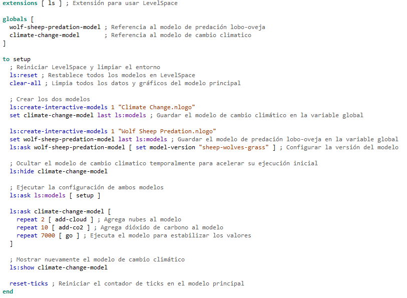
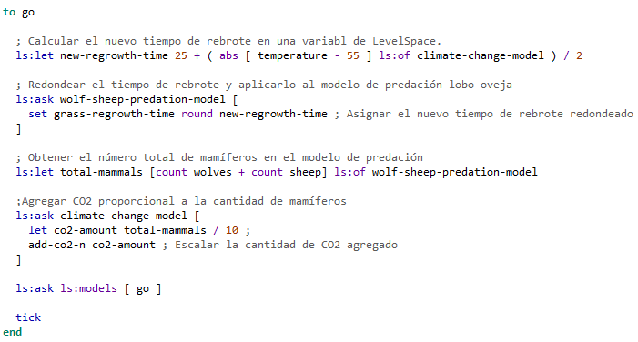
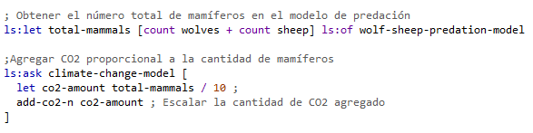
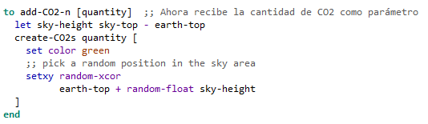

# Tarea Level Space
Nicolas Parra
## Comentarios

## Modificaciones
Como conectar ambos modelos\
\
Funcion integrada en el Climate Change Model para recivir cantidades de CO2 y que sea proporcional a la cantidad de animales en el otro modelo.\ 

## Pregunta 
Esta herramienta podría ser útil para integrar un agente de toma de decisiones (basado en agentes independientes con distintas personalidades) mediante la simulación de un entorno, similar a ScienceWorld, permitiendo la visualización de los acontecimientos. Esto es especialmente valioso debido a la complejidad de integrar ScienceWorld, dada su amplia gama de opciones y la dificultad de su código. Un entorno autorregulado no solo permitiría actualizar el agente en tiempo real, sino que también brindaría la oportunidad de observar los efectos de un ambiente simulado en tiempo real sobre el agente. Aunque esta idea ha sido descartada debido a que ScienceWorld ya cumple con los requisitos necesarios, podría ser un proyecto interesante para el futuro.