# Tarea respondiendo preguntas 2
Nicolas Parra \
Rodolfo Vergara
## Pregunta 1
La numeracion de las reglas esta dada por la represntacion binaria resultante de combinar los vecindarios (e.g.)
Tomemos la siguiente regla \
111 -> 0 \
110 -> 0 \
101 -> 0 \
100 -> 1 \
011 -> 1 \
010 -> 1 \
001 -> 1 \
000 -> 0 \
Al combinar los resultados se obtiene la secuencia 00011110 por lo tanto esta regla es la 30.
## Pregunta 2
La regla 30 es importante debido a que genera patrones aparentemente aleatoreos, esto pese a la simplicidad y naturaleza determinista de la regla.
## Pregunta 3 
La regla 8 es terrible fome, donde cualquier combinacion de tuplas de valores resulta en un 0 exceptuando la 100.
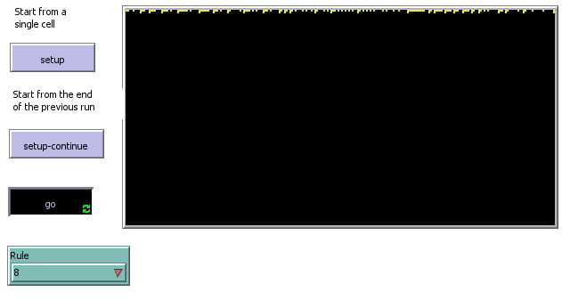
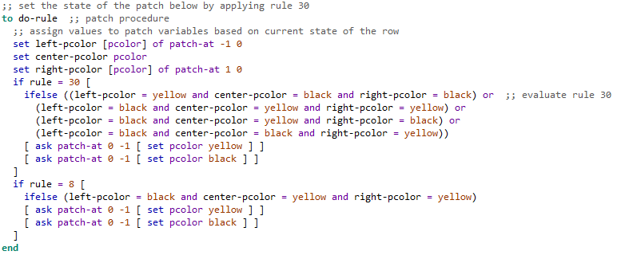
Se puede apreciar que la secuencia no continua debido a la poca cantidad de disponibilidad de generacion de '1s'.
## Pregunta 4
Todo sistema no trivial puede ser traducido a un programa de computador.
Es decir que los sistemas sencillos pueden realizxar calculos tan complejos como los sistemas mas avanzados.
## Pregunta 5
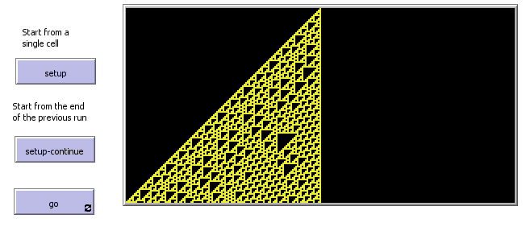
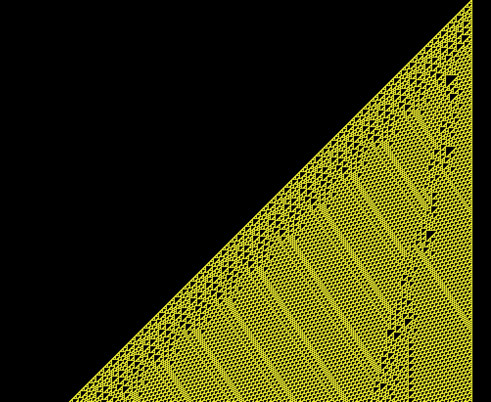
Se pueden observar patrones simples que evolucionan a un patron mas complejo de forma regular.
Segun wikipedia es turing-completo lo cual implica que puede hacer cualquier cantidad de calculos.
## Pregunta 6
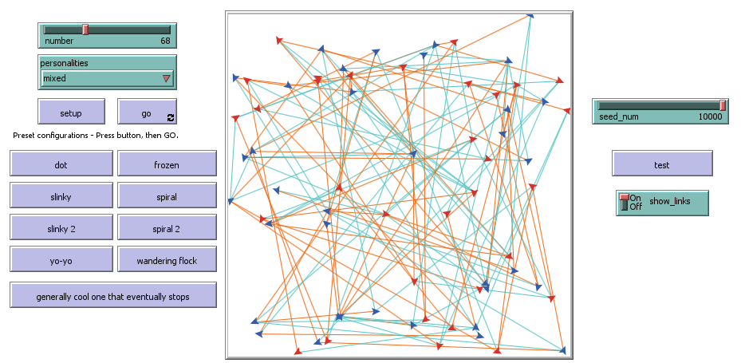
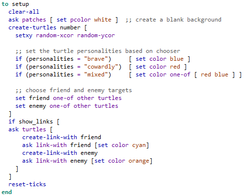
## Pregunta 7
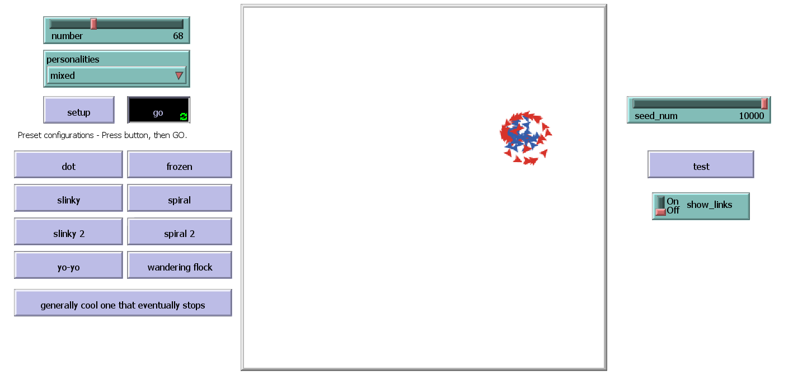
La semilla 10000 genera un espiral de agentes que eventualmente se convierte en un punto.
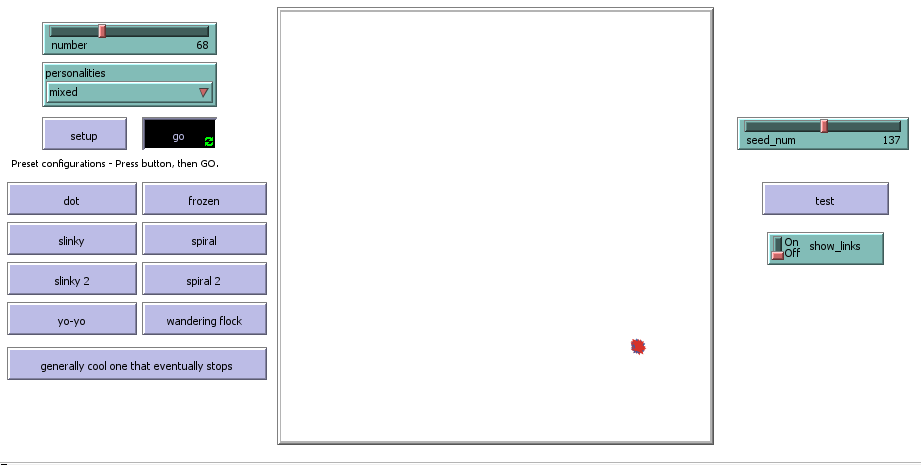
La semilla 137 genra un punto de forma inmediata.
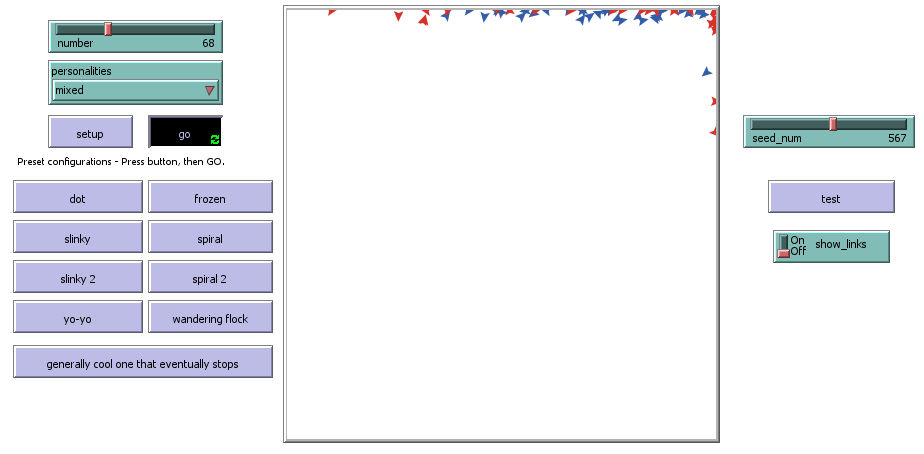
La semilla 567 genera un patron estatico donde los agentes no pueden moverse.
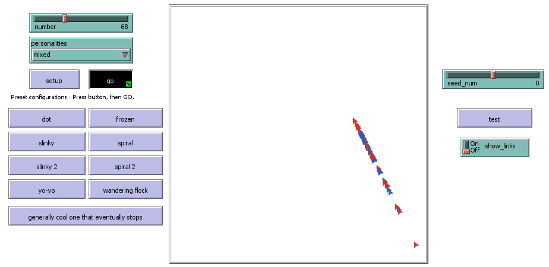
La semila 0 genera un patron en constante movimiento similar a una serpiente.
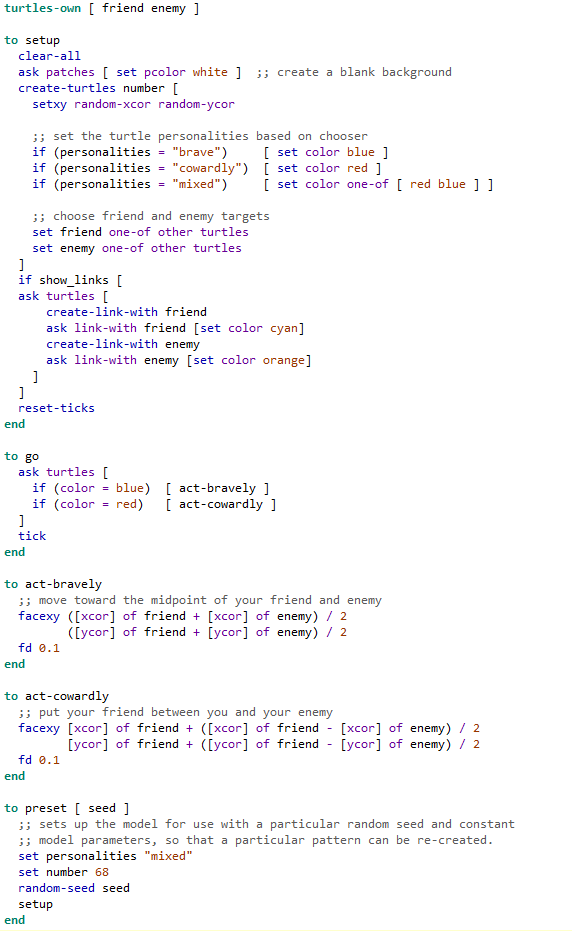